# PLAYBOX-BLOG

A web application for console collectors, enabling users to manage their personal collection, browse consoles, and interact with other users.

## Features

### **User Authentication**
- Register new users
- Login for registered users
- Logout

### **Profile Management**
- View user profile (email, username, avatar)
- Edit username
- Edit avatar URL
- Delete profile (with confirmation)

### **Console Management**
- View a list of all added consoles (public catalog)
- View details of a specific console
- Add a new console to the catalog (logged-in users only)
- Edit information about your own console
- Delete your own console

### **Comments**
- Users can add comments to any console listed in the catalog.
- Display all comments for a console in the details page.
- Users can edit or delete their own comments.

### **Likes**
- Users can like consoles that are not their own.
- Display the number of likes for each console (if a counter is implemented).

### **Navigation and User Interface**
- Navigation menu
- Home page
- Login/Registration page
- Profile page
- Console catalog page
- Console details page
- Create/Edit console page
- Error messages and loading indicators (Spinner)

## Technologies

- **Frontend:** React, CSS Modules, React Router
- **Backend:** Node.js
- **Testing:** Vitest, React Testing Library

## Installation and Setup

1. **Clone the repository:**
    ```bash
    git clone https://github.com/ilto86/PlayBox-Blog.git
    cd PlayBox-Blog
    ```

2. **Install dependencies:**
    - **For Frontend (in the `client` folder):**
        ```bash
        cd client
        npm install
        ```
    - **For Backend (if you have a separate `server` folder):**
        ```bash
        cd ../server
        npm install
        ```

3. **Run the application:**
    - **Start the Backend server (if applicable):**
        ```bash
        # In the /server folder
        node ./server.js
        ```
    - **Start the Frontend application (in the `client` folder):**
        ```bash
        # In the /client folder
        npm run dev
        ```

4. Open [http://localhost:5173](http://localhost:5173) (or the port Vite is running on) in your browser.

## Screenshots

### **Home Page**
*Description:* The first page users see.
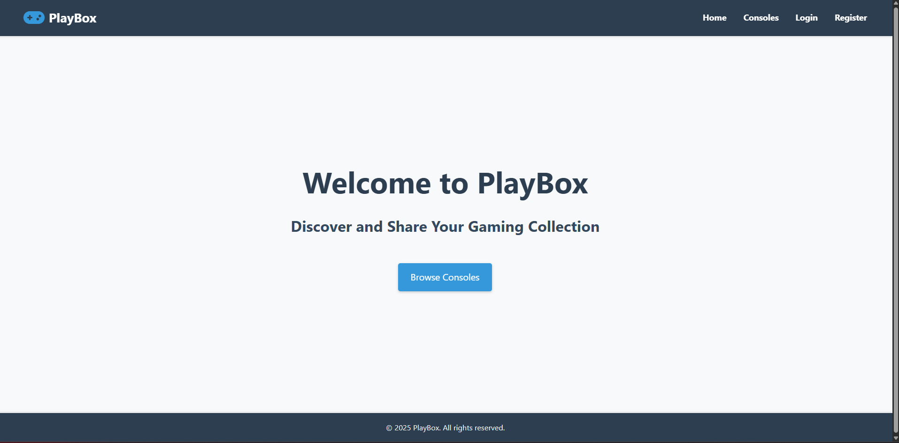

### **Registration/Login**
*Description:* Forms for user registration and login.
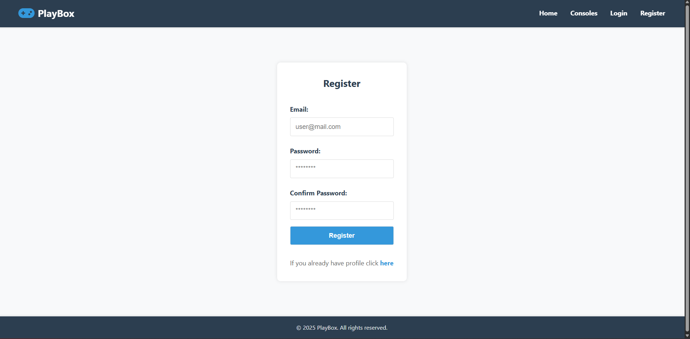
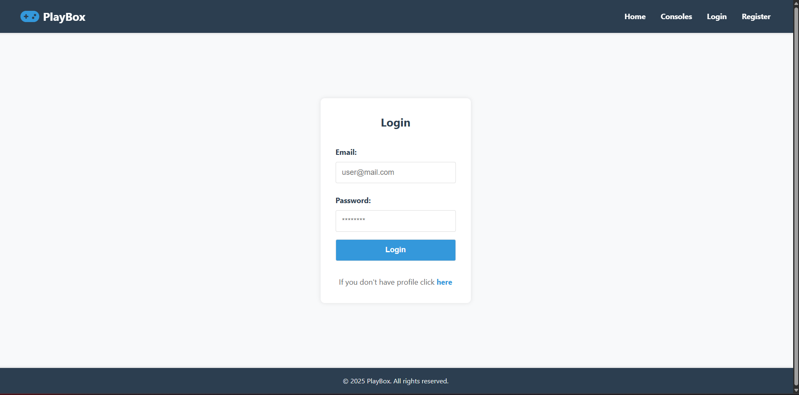

### **User Profile**
*Description:* The profile page displaying user information and their consoles.
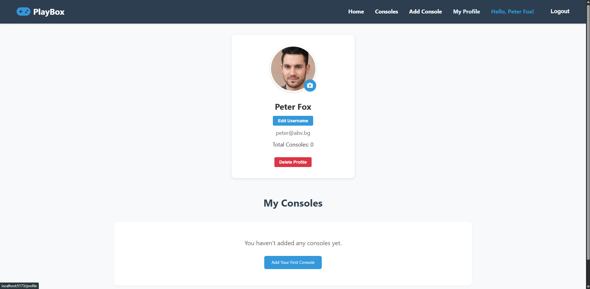
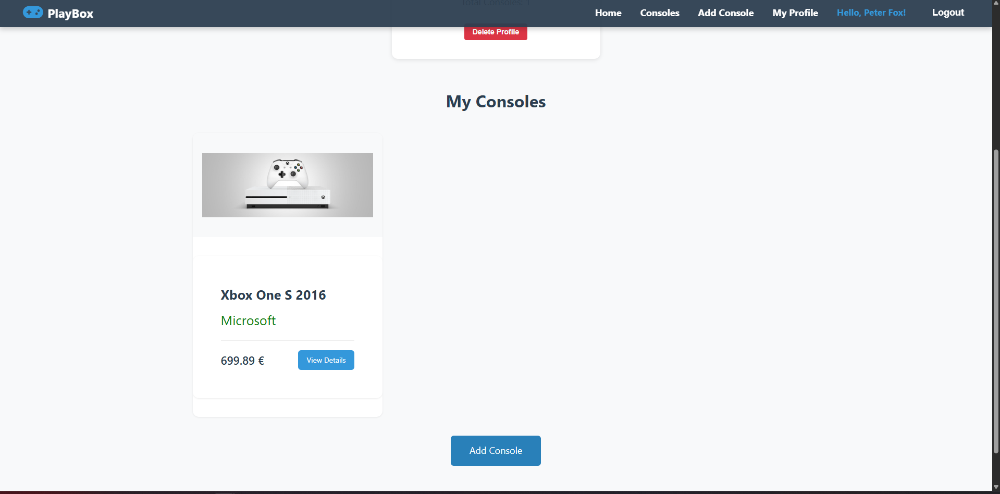

### **Console Catalog**
*Description:* A list of all consoles.
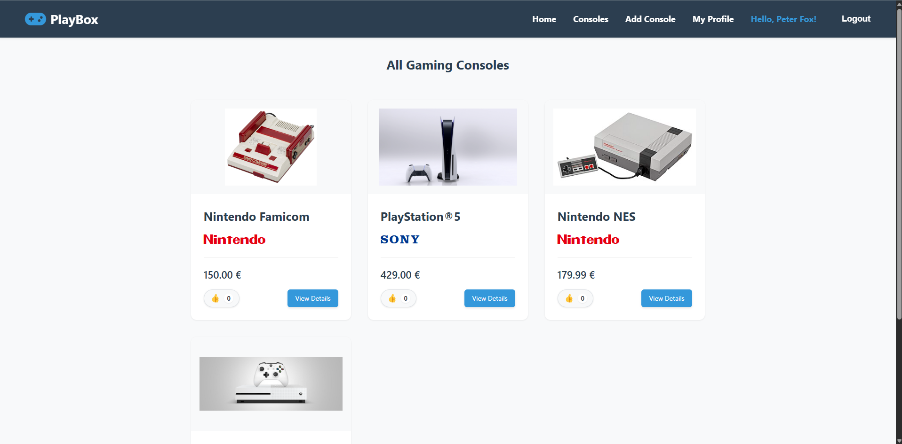

### **Console Details**
*Description:* Detailed information about a specific console.
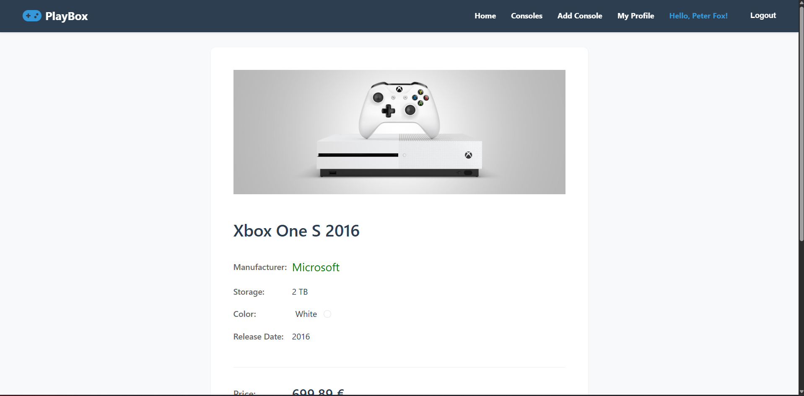
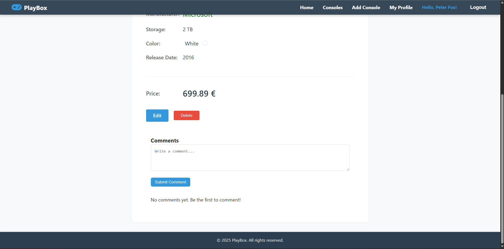

### **Add Console**
*Description:* Form for adding a console.
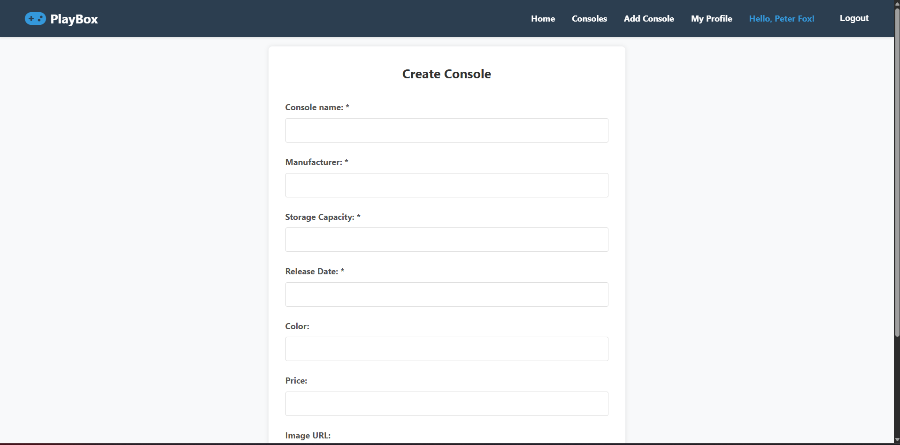
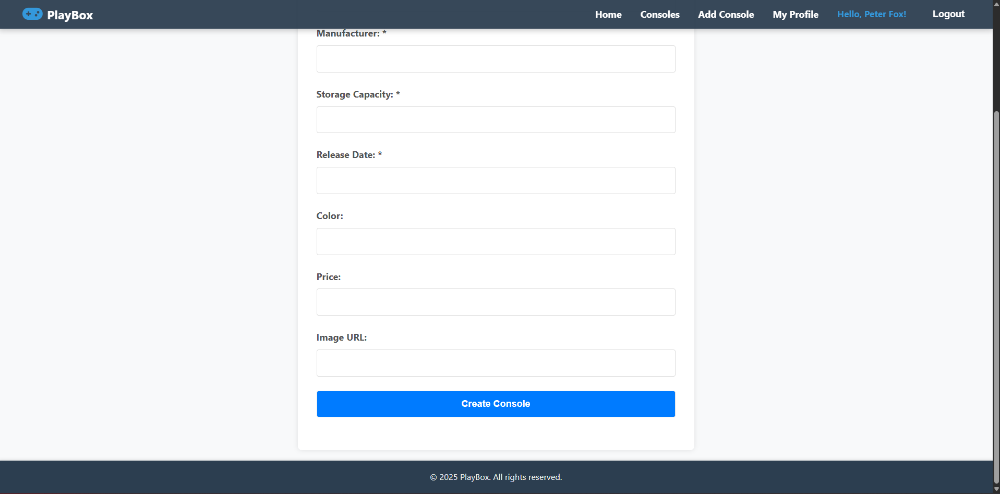

### **Edit Console**
*Description:* Form for editing a console.
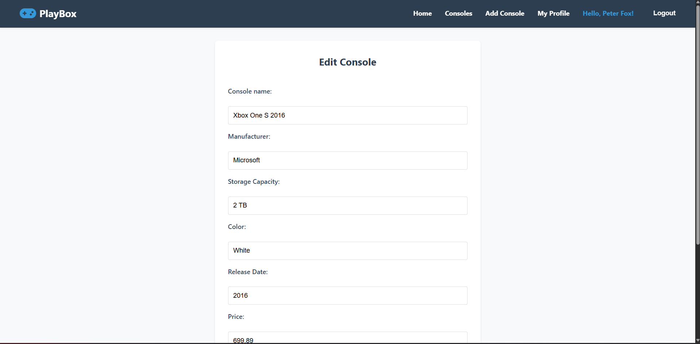
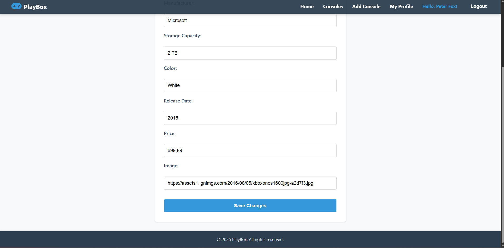


### **Delete Console**
*Description:* Confirmation dialog for deleting a console.
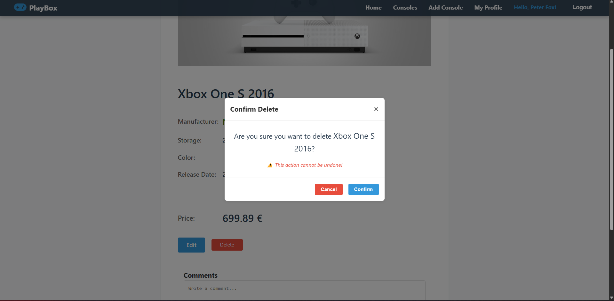
